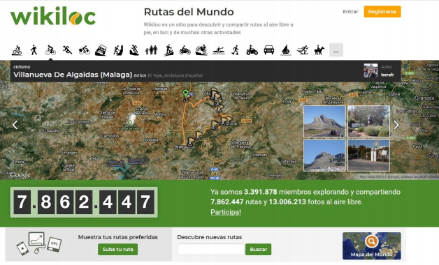
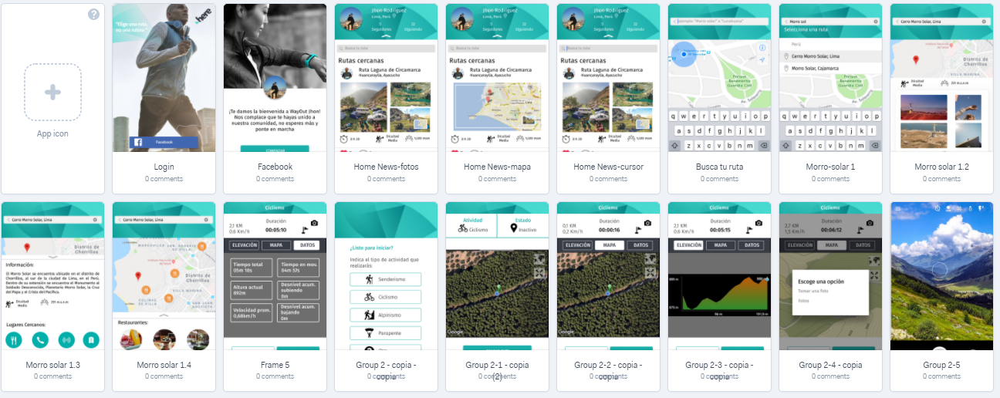

# WayOut

Es una aplicación inspirada en personas que practican deportes al aire libre (ciclismo, running, montañismo, caminatas, etc). Brinda información de los lugares cercanos a tu ubicación, permite monitorear recorridos, guardar rutas y compartirlas en redes sociales y seguir a otros usuarios.

## Desarrollado para [Here Maps](https://www.here.com/en)

### Objetivo

Diseñar una aplicación móvil que permita a los usuarios trackear y monitorear recorridos que se realicen en senderos al aire libre/outdoor para cualquier departamento de Turismo en el Perú.

### Principales Requerimientos

+ Brindar la ubicación ya sea mediante coordenadas geográficas o nombre del lugar
+ Un buscador de lugares cercanos a tu entorno (restaurantes, hoteles, etc)
+ Debe tener la opción de grabar ruta
+ Debe mostrar punto de origen y punto de destino
+ Compartir en redes sociales.

## Descubrimiento e Investigación 

### Research

El reto fue planteado por la empresa [Here Maps](https://www.here.com/en), la cual propuso tomar como modelo a 'Wikiloc'.

De nuestra investigación resaltamos los siguientes features:
+ Un newsfeed con las rutas cercanas a tu ubicación
+ Permite seleccionar diferentes actividades deportivas
+ Buscar cualquier destino en todo el mundo
+ Seguir rutas de otros usuarios
+ Datos importantes de cada ruta como nivel de dificultad, distancia, tiempo de recorrido, etc.
+ Comentar y dar like a las publicaciones de los usuarios.

### Benchmarking

Se realizó un estudio comparativo entre las mejores aplicaciones para outdoors:

_[Wikiloc](https://www.strava.com/mobile)_ Aplicación para deportes al aire libre, permite grabar rutas en el móvil o compartirla por redes sociales o en la web de Wikiloc desde donde es posible administrar los tracks. Requiere conexión de datos.

_[Strava](https://www.strava.com/mobile)_ Es una aplicación para las personas amantes del running y el ciclismo. Con Strava puedes hacer seguimiento de tus recorridos o vueltas ciclistas. Una de sus caraterísticas es que puedes sincronizar los contactos de tu teléfono para poder seguirlos, como una red social. Asimismo, puedes unirte a retos y compartir fotos de tus actividades.

_[RunKeeper](https://runkeeper.com/index)_ Su principal objetivo es motivar a las personas a seguir corriendo y lograr sus objetivos. Tiene una sección que direcciona a Google Play para escuchar tu playlist, estadísticas de tiempo y las rutinas elegidas.También puedes sincronizar tus contactos de facebook y compartir tus actividades. Enfocada en running, sin embargo permite elegir otras actividades como caminata, ciclismo, natación, esquí, patinaje, etc.

_[Komoot](https://www.komoot.com/)_ Esta app está enfocada en facilitar las actividades y deportes al aire libre, tales como ciclismo de ruta, senderismo, ciclismo de montaña, etc. Komoot genera enrutamiento topográfico específico según el deporte que se haya elegido. A diferencia de las anteriores app's, podemos seguir a otros usuarios pioneros en marcar una ruta o un nuevo sendero en cualquier parte del mundo.

_[ViewRanger](http://www.viewranger.com/es)_ La particularidad de la aplicación es que te permite comprar mapa y en realidad aumentada. Logra identificar picos, lagos y lugares cerca de ti con sólo usar la cámara del dispositivo móvil. Además que no es necesario tener cobertura móvil para acceder a los mapas.

## Ideación

### Paper prototyping & testing

Se llevo a cabo una iteración con tres usuarios potenciales, los resultados fueron los siguientes:

+ Preferencia del newsfeed como vista principal en lugar del mapa de ubicación
+ Modificación de los datos de interés en la información de las rutas
+ Se tuvo como favorita la opción de ver fotos de la ruta publicada por los usuarios
+ Opinión unánime de fácil usabilidad y diseño simple.

## Prototipo en Alta Fidelidad

+ [Ver demo completa en Marvel](https://marvelapp.com/153cj2dg)
+ [Ver flujo en Invision](https://invis.io/NJGSCTURV9U)

## Equipo
+ [Yoanna Hernandez](https://github.com/YoannaHS)
+ [Yasmin Mattos](https://github.com/YasminMattos)